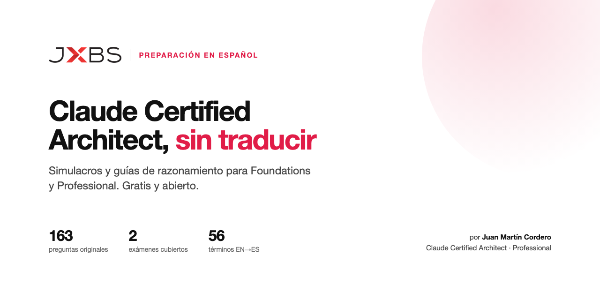

# Claude Certified Architect — preparación en español

Simulacros y guías de razonamiento para las dos certificaciones de arquitecto de Anthropic: **Foundations (CCAR-F)** y **Professional (CCAR-P)**. Gratis, sin registro, con 163 preguntas originales y un simulador que corrige y explica cada respuesta.

Escrito por alguien que rindió el Professional y lo aprobó.

### ▶︎ [Abrir el simulador](https://juanmartincoma-collab.github.io/claude-certified-architect-es/simulador/)

Elegís examen y longitud, el sorteo respeta los pesos oficiales de cada dominio, corre el cronómetro al ritmo real, y al final te dice en qué dominio estás flojo y cuál de los dos exámenes te conviene rendir.

---

## Por qué existe

El examen es solo en inglés. Si el inglés no es tu primer idioma, la dificultad no está en la arquitectura: está en leer enunciados densos contra el reloj. Rendí el Professional en agosto de 2026 y salí con una lista de todo lo que me hubiera servido tener antes de entrar. Esto es esa lista.

Lo que ya existía en la comunidad cubre **Foundations** y está en inglés o traducido a máquina. Del **Professional** no había nada en español. Acá están los dos.

## Los dos exámenes

|  | **Foundations** · CCAR-F | **Professional** · CCAR-P |
|---|---|---|
| Preguntas | 60 | 63 |
| Tiempo | 120 minutos | 120 minutos |
| Nota de corte | 720 / 1000 | 720 / 1000 |
| Costo | USD 125 | USD 175 |
| Vigencia | 12 meses | 12 meses |
| Entrega | Proctored, Pearson VUE | Proctored, Pearson VUE |
| Qué mide | Mecánica y conceptos: cómo funcionan agentes, tools, prompts, Claude Code y contexto | Criterio aplicado: dado un caso con restricciones, qué decisión de arquitectura |
| Dominios | 5 | 7 |

**Cuál rendir.** Si dominás las piezas pero todavía no tomás decisiones de arquitectura bajo restricciones, Foundations. Si ya diseñás sistemas en producción y sabés defender trade-offs frente a un cliente, Professional. El simulador te lo dice con datos: rendí uno de cada uno y te da una recomendación comparando los dos resultados.

## Qué hay acá adentro

| | Foundations | Professional |
|---|---|---|
| Guía de razonamiento | [foundations/guia.md](foundations/guia.md) | [profesional/guia.md](profesional/guia.md) |
| Examen de práctica | [foundations/examen.md](foundations/examen.md) · 60 preguntas | [profesional/examen.md](profesional/examen.md) · 63 preguntas |
| Clave con explicación | [foundations/respuestas.md](foundations/respuestas.md) | [profesional/respuestas.md](profesional/respuestas.md) |

Además: [glosario EN → ES](glosario.md) con los 56 términos del examen, y [preguntas frecuentes](FAQ.md).

Las guías son lo que más se usa. No son resúmenes de la documentación: están organizadas por **la diferencia entre dos opciones parecidas**, que es donde el examen te pone a elegir. Cada concepto trae qué es, cómo funciona, cuándo aplica, cuándo **no**, y la trampa típica.

## Cómo usarlo en 30 segundos

1. Abrí el [simulador](https://juanmartincoma-collab.github.io/claude-certified-architect-es/simulador/) y hacé 30 preguntas con corrección al responder. Vas a ver en qué dominio estás flojo.
2. Leé la guía de ese dominio.
3. Volvé al simulador y hacé el examen completo con cronómetro y corrección al final.

No hay que instalar nada, ni clonar, ni registrarse. El simulador corre entero en tu navegador y no envía datos a ningún lado.

## Cómo se hizo esto

Las preguntas son **originales**. Se escribieron contra los objetivos que Anthropic publica en la guía oficial de cada examen, respetando los pesos del blueprint y la proporción de formatos. Ninguna reproduce, parafrasea ni deriva de un ítem del examen real.

Dos decisiones de diseño que vale la pena conocer, porque afectan cuánto te sirve practicar acá:

**Sin sesgo de longitud.** En muchos simulacros la respuesta correcta es siempre la más larga, y uno aprende a explotar eso en vez de a razonar. Acá la correcta es la opción más larga en el 29% de los ítems, contra el 25% que daría el puro azar: medir no te sirve de nada. Las cuatro opciones de un ítem se llevan siete caracteres de diferencia entre la más larga y la más corta, así que la diferencia ni se ve.

**Sin cláusulas delatoras.** Ninguna opción trae su propia justificación adentro. Todas son afirmaciones secas del mismo largo y la misma forma gramatical.

## Preguntas frecuentes

Están en [FAQ.md](FAQ.md), con respuestas cortas a lo que la gente pregunta antes de inscribirse: cuánto cuesta, cuánto hay que estudiar, si hay preguntas de código, qué pasa si reprobás, y si vale la pena.

## Aviso legal

**No oficial.** Este proyecto no está afiliado a Anthropic PBC, ni patrocinado, ni avalado, ni certificado por Anthropic. No representa a Anthropic ni a Pearson VUE.

**Marcas.** *Claude*, *Claude Certified Architect* y *Anthropic* son marcas de Anthropic PBC. Se usan aquí de forma nominativa, con el único fin de identificar el examen para el que este material prepara, sin sugerir origen, patrocinio ni aval.

**No es contenido del examen.** Todas las preguntas son de elaboración propia, redactadas a partir de los objetivos y pesos publicados en la guía oficial del examen. Este material **no reproduce, transcribe, parafrasea ni deriva** de ningún ítem, opción, escenario o material del examen real, cuyo contenido es confidencial y propiedad de Anthropic, y cuya divulgación está prohibida por el acuerdo de confidencialidad que acepta todo candidato. El autor está sujeto a ese acuerdo y lo ha cumplido.

**Sin garantías.** El material se entrega "tal cual", sin garantía de exactitud, vigencia ni idoneidad para ningún fin. Aprobar depende de vos. Ningún simulacro garantiza un resultado.

Texto completo en [AVISO-LEGAL.md](AVISO-LEGAL.md).

## Privacidad

El simulador no tiene servidor. Todo corre en tu navegador y lo que guarda —tu progreso y tu nombre, si lo escribís— queda en el almacenamiento local de tu equipo. No hay analítica, ni cookies, ni envío de datos a terceros. Podés borrarlo vaciando los datos del sitio.

## Quién lo hizo

**Juan Martín Cordero** — fundador de [JXBS.ai](https://jxbs.ai) y de Externa. Abogado que nunca ejerció, headhunter durante doce años, autor de *El Arte de Conseguir Empleo*.

Claude Certified Architect — Professional, agosto de 2026. [Verificar la credencial](https://www.credly.com/badges/12586022-02b9-4a41-a577-55c32dca7e78) · [LinkedIn](https://www.linkedin.com/in/juanmartincordero/)

## Contribuir

¿Encontraste una pregunta con un error, una explicación floja o una traducción mejorable? [Abrí un issue](../../issues/new/choose). Se agradece especialmente el reporte de respuestas discutibles: si dos opciones se defienden, la pregunta está mal escrita y hay que arreglarla.

Detalles en [CONTRIBUTING.md](CONTRIBUTING.md).

## Licencia

Contenido —guías, preguntas, respuestas, glosario— bajo [CC BY 4.0](LICENSE): usalo, adaptalo y compartilo, incluso comercialmente, citando la fuente. Código del simulador bajo [MIT](LICENSE-CODE).

---

¿Preparándote en inglés? El trabajo de referencia de la comunidad es [claude-certified-architect](https://github.com/paullarionov/claude-certified-architect) de Paul Larionov, que cubre Foundations en quince idiomas. Esto no lo reemplaza: cubre además el Professional y agrega simulador y método de razonamiento en español.

· [English](README.en.md) ·
